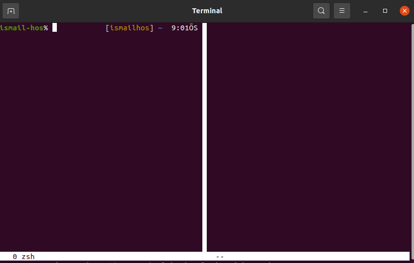
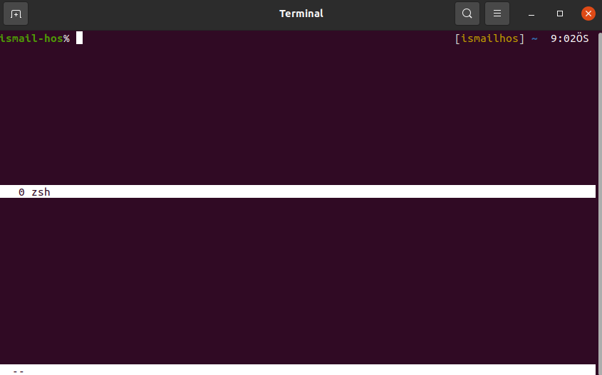
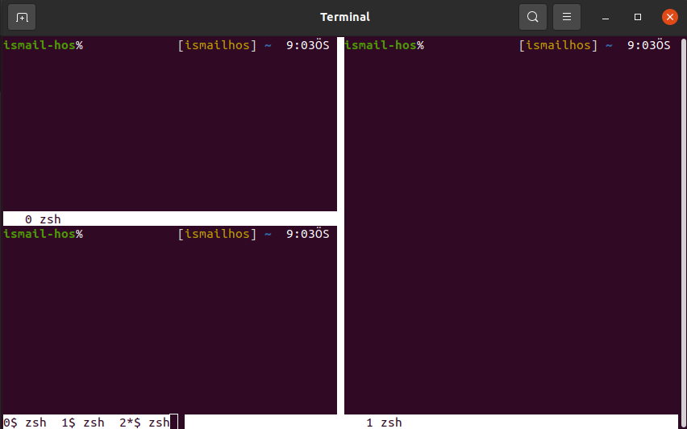
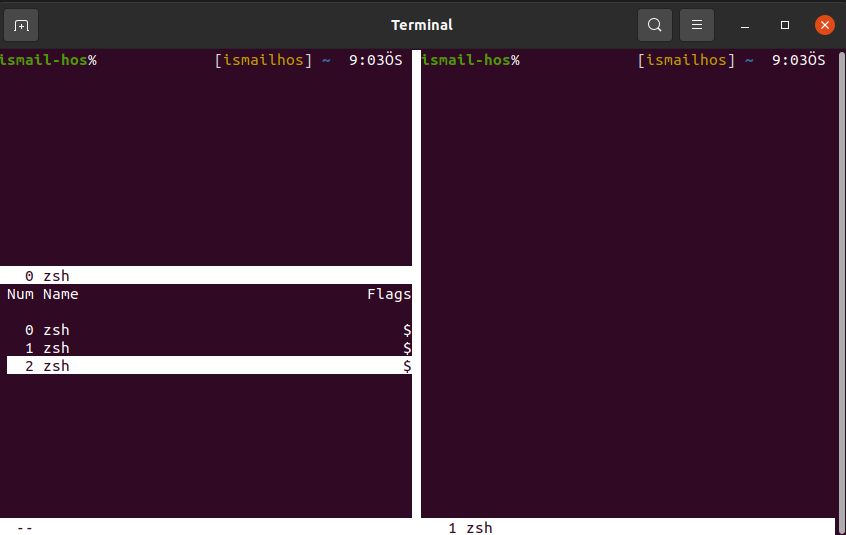
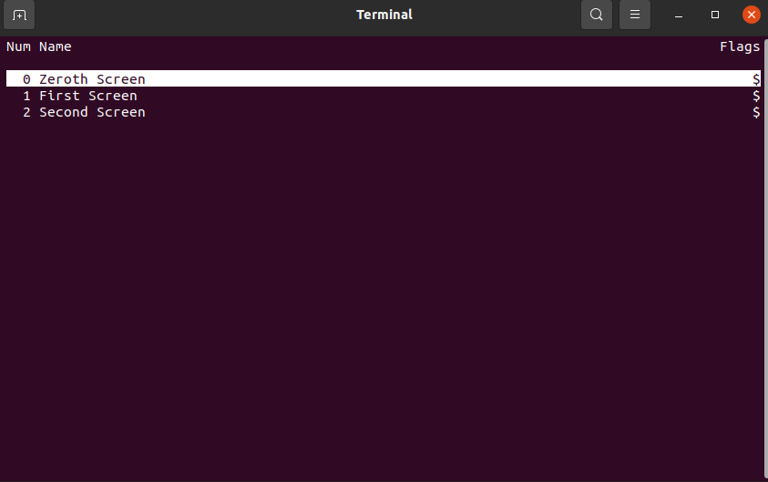
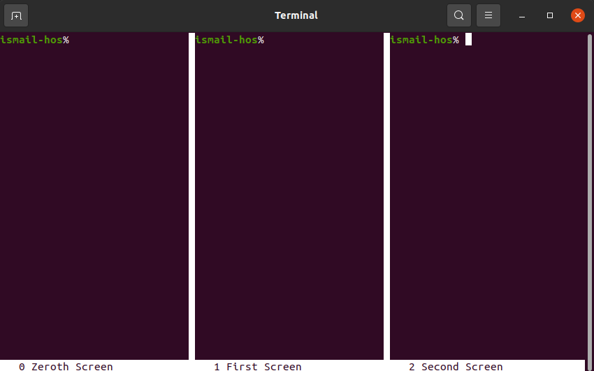

# `screen` command

Screen is used to run terminal commands in the background, divide the terminal window and use multiple terminals on one window. 

You can start screen by typing `screen` on the commandline.

## Split
Then divide your window vertically by `ctrl+z` and `|`.

And/or divide your window horizontally by `ctrl+z` and `shift+s`.

## Move
Press `ctrl+z` and `tab` for jumping to the next half, or `ctrl+z` and `shift+tab` for the previous half.

`ctrl+z` and `c` opens new terminal on the current half. You can see the numbres at the bottom-left corner of each space.

Or you can print all the terminal numbers by pressing `ctrl+z` and `w`.

You can change the active terminal by `ctrl+z` and `space`.

## Resize

You can change the size of any split using `ctrl+z` and `:resize` and the number of characters (horizontally) or lines (vertically).

In the below example `ctrl+z` and `:resize 7` is used for the terminal number 2 and `ctrl+z` and `:resize 25` is used for the terminal number 1.

To cancel all the splits and focus on only one screen you can press `ctrl+z` and `shift+q`.

The other screens are not killed with this. You can see it with `ctrl+z` and `w`.

You can change see the active terminal with `ctrl+z` and `w`. There is `*` near to the terminal number.

To change the active terminal here, you can again use `ctrl+z` and `space`. Other ways to change the active terminal are listed below.
* `ctrl+z` and `number` of the terminal you want to activate, and
* `ctrl+z` and `"` to list the terminals and choose one of those with the arrow keys (or k to above j to below).

## Name the Screen windows
When you press `ctrl+z` and `"`, you will see that all the screens are named as `zsh` as default. 

You can change it by pressing `ctrl+z` and `shift+a`, then deleting `zsh` and writing the new name.

In the below picture, the names are changed and shown by pressing `ctrl+z` and `"`.

You can also see the changes when you split your terminal window vertically into 3 for example by pressing `ctrl+z` and `|` two times.

## Kill a Screen window
Here you can kill a window by pressing `ctrl+z` and `k`. It asks you to press `y` if you are sure to kill that window.

You can kill all the windows in this Screen session by `ctrl+z` and `\`.

## Name, detach and attach
`screen -S name` is the command to give a name to a Screen session.

Use `ctrl+z` and `d` to detach from a Screen session.

Use `screen -r name` to reattach to the Screen session.

You will notice that working jobs continue working even we detach from a screen.

