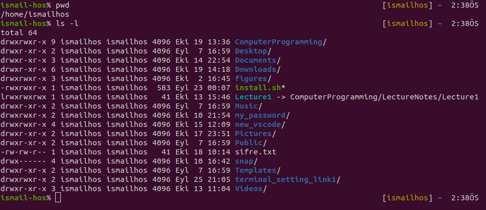
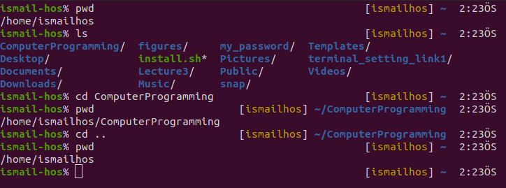
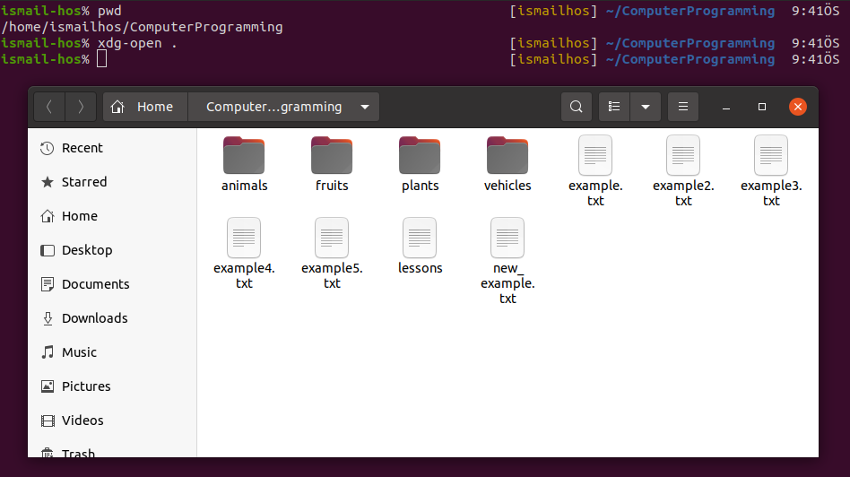

# Computer Programming

## `pwd` Command

`pwd` stands for `Print Work Directory` in Linux. Terminal opens at the home directory by default in Ubuntu. If you type pwd and press Enter you will see your home directory.


## `ls` Command

We can list the files and folders in a directory using this command. It shows the files and folders located in your /home/"computer_name" directory. 


`ls` also has some options with it. One of them is `ls -l` which prints the details of the files such as the size of a file in KB and the date that the file has been created.



The other is `ls -la` and used for printing also the hidden files starting with `.` in your working directory.


## `cd` Command

Once you have a folder, you can move into it using the `cd` command. `cd` means `Change Directory` in Linux. You invoke it specifying a folder to move into. You can specify a folder name, or an entire path.


You can use the `..` special path to indicate the parent folder:

`cd ..` 



## `mkdir` Command

You create folders using the mkdir command:

`mkdir fruits`


You can create multiple folders with one command:

`mkdir plants animals`


You can also create multiple nested folders by adding the -p option:

`mkdir -p fruits/apples`


You can also create a new set of nested files:

`mkdir -p vehicles/electric_vehicles/tesla_car`


## `touch` Command

You can create an empty file or files using the touch command:

`touch lessons`


## `rmdir` Command

Just as you can create a folder using `mkdir`, you can delete a folder using `rmdir`:

`mkdir test_file`

`rmdir test_file`

The folder you delete must be empty!


You can also delete multiple folders at once:

`mkdir testfile1 testfile2`

`rmdir testfile1 testfile2`

The folders you delete must be empty!


## `rm` Command

To delete folders with files in them, we'll use the more generic `rm` command which deletes files and folders, using the `-rf` option:

When this command is used alone, it only deletes files, not folders.

`rm TestFile.txt`


If this command is used with `-rf` option, deletes everything such as folders and files. 


## `cat` Command 

This command can add content to a file, and this makes it super powerful.
In its simplest usage, `cat` prints a file's content to the standard output:

`cat example.txt` 


You can print the content of multiple files:

`cat example.txt example2.txt` 


and using the output redirection operator `>` you can concatenate the content of multiple files into a new file:

`cat example.txt example2.txt > new_example.txt`

Here, ***new_example.txt*** is a concatenated version of files ***example.txt*** and ***example2.txt***


To write to a file, we’ll make cat command listen to the input stream and then redirect the output of cat command into a file using the Linux redirection operators “>”.

Concretely, to write into a file using cat command, we enter this command into our terminal:

```cat > readme.txt``` 

We’ll see that once again the terminal is waiting for our input.

However, this time it won’t echo the texts we’ve entered. This is because we’ve instructed the command to redirect the output to the file readme.txt instead of the standard output stream.

Let's enter some text in the terminal and then continue with CTRL+D to terminate the command:

```
cat > readme.txt
This line was written by using terminal. # After typing, press CTRL+D to exit.
```


Using `>>` you can append the content of multiple files into a new file, creating it if it does not exist:

`cat example.txt example2.txt >> example3.txt`

`cat example3.txt`


When you're looking at source code files it's helpful to see the line numbers. You can have cat print them using the -n option:

`cat -n example3.txt`


You can only add a number to non-blank lines using -b:

`cat -b example3.txt`


The command `cat > example5.txt` creates a new file as output. We can write text in this file from the terminal.


When we want to write in a present file via on terminal:

`cat >> example5.txt` 


## `echo` Command
  
We use `echo` to print anything on the command line:


We can also use `echo` to write something into a file:


If the file does not exist, we should use single `>` instead of `>>` :


## `tail` Command

You can print the last 2 (or NUM) lines in a file:

`tail -n 2 example3.txt`


You can print the whole file content starting from a specific line using `+` before the line number:

`tail -n +2 example3.txt`


## `xdg-open` Command

`xdg-open file_name or folder_name` 

This command opens the specified file or folder.


To open current directory:

`xdg-open .` is always used to open the current directory. Here the dot represents the current directory.



## `mv` Command

Once you have a file, you can move it around using the `mv` command. You specify the file current path, and its new path:

`mv mvcommand.txt move_command.txt`

Here, mvcommand.txt is renamed as move_command.txt.


`mv move_command.txt plants`

Here, move_command.txt is moved into the plants folder.


If the last parameter is a folder, the file located at the first parameter path is going to be moved into that folder. In this case, you can specify a list of files and they will all be moved in the folder path identified by the last parameter:

`mv example.txt example2.txt example3.txt example4.txt example5.txt examples`


## `cp` Command

You can copy a file using the `cp` command:


To copy folders you need to add the `-r` option to recursively copy the whole folder contents:


To copy multiple files to in to a folder:

`cp lesson1 lesson1_new lessons_folder` --> The lesson1 and lesson1_new is copied in to the lessons_folder


